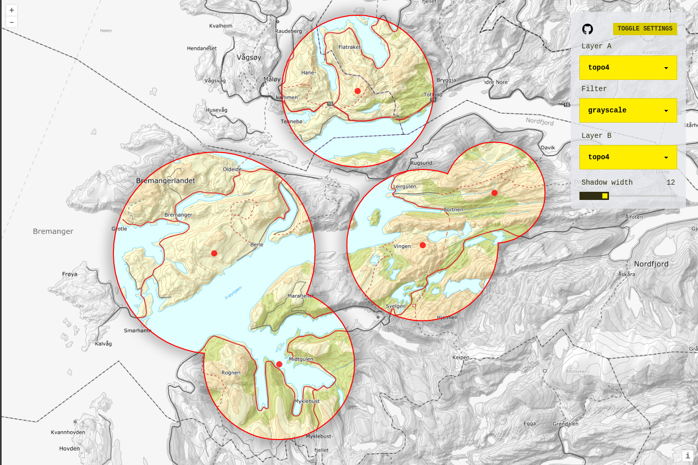

# "Fog of war" experiment

Simple experiment with a "fog of war" effect. Try it out at https://experiment-fog-of-war.netlify.app/.

[Open in CodeSandbox](https://githubbox.com/orbat-mapper/experiment-fog-of-war)

Warning: Some of the map layers does not load when using StackBlitz and Firefox.

All the code for drawing the map is available in [src/geo.js](src/geo.js). All other files are for the user interface. 

Libraries used:
- [OpenLayers](https://openlayers.org/) for drawing the map
- [ol-ext](https://viglino.github.io/ol-ext/) for layer filters
- [Turf.js](https://turfjs.org/) for geometry calculations

Screenshot:

## Getting started

Clone repo:

    $ git clone https://github.com/orbat-mapper/experiment-fog-of-war.git

Navigate to project root:

    $ cd experiment-fog-of-war

Install dependencies:

    $ npm install

To start a development server run:

    $ npm run dev

The demo is now running on http://localhost:5173/. 
